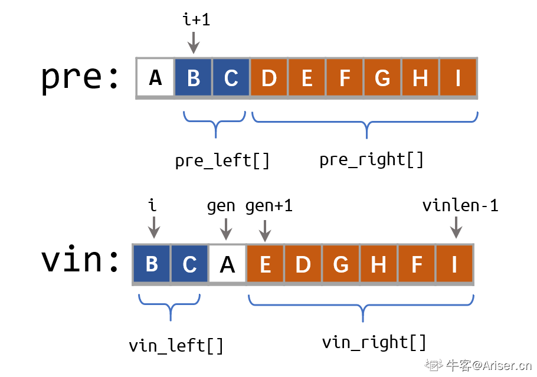

# 重建二叉树

输入某二叉树的前序遍历和中序遍历的结果，请重建该二叉树。假设输入的前序遍历和中序遍历的结果中都不含重复的数字。

 
**例如，给出**

```
前序遍历 preorder = [3,9,20,15,7]
中序遍历 inorder = [9,3,15,20,7]
返回如下的二叉树：

    3
   / \
  9  20
    /  \
   15   7
```

**限制：**

`0 <= 节点个数 <= 5000`

来源：力扣（LeetCode）
链接：https://leetcode-cn.com/problems/zhong-jian-er-cha-shu-lcof

## 解法

### 递归

算法背景：

前序遍历递归算法：NLR 先访问根结点N，再遍历左子树L，再遍历右子树R。

中序遍历递归算法：LNR 先访问左子树L，再访问根结点，再遍历右子树R。

根据前序遍历和中序遍历可以确定二叉树：

前序序列第一个结点确定二叉树的根结点
根据根结点在中序序列中的位置，前部分为根结点的左子树，后部分分为根结点的右子树。
再对分割出来的左子树和右子树进行递归分析。



**复杂度分析**

时间复杂度O(nlogn)
空间复杂度O(logn)

```cpp
/**
 * Definition for a binary tree node.
 * struct TreeNode {
 *     int val;
 *     TreeNode *left;
 *     TreeNode *right;
 *     TreeNode(int x) : val(x), left(NULL), right(NULL) {}
 * };
 */
class Solution {
public:
    TreeNode* buildTree(vector<int>& preorder, vector<int>& inorder) {
        int len = preorder.size();
        if (len == 0) {
            return NULL;
        }
        // 前序左子树序列，右子树序列。 中序左子树、右子树序列。
        vector<int> pre_left, pre_right, in_left, in_right;
        int index = 0;
        TreeNode *root = new TreeNode(preorder[0]); // 前序序列的第一个结点是有左子树和右子树的根结点（狭义根结点）
        for (int i = 0; i < len; ++i) {
            if (inorder[i] == preorder[0]) {
                index = i; // 找到分割位置
                break;
            }
        }
        for (int i = 0; i < index; ++i) {
            pre_left.push_back(preorder[i+1]);
            in_left.push_back(inorder[i]);
        }
        for (int i = index + 1; i < len; ++i) {
            in_right.push_back(inorder[i]);
            pre_right.push_back(preorder[i]);
        }
        // 递归
        root->left = buildTree(pre_left, in_left);
        root->right = buildTree(pre_right, in_right);
        return root;
    }
};
```