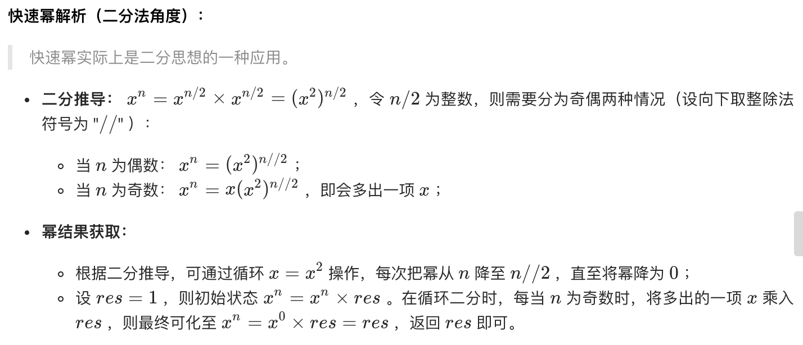
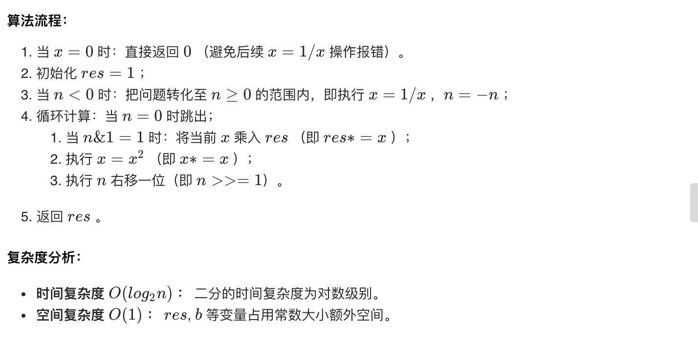

# 16. 数值的整数次方

实现函数double Power(double base, int exponent)，求base的exponent次方。不得使用库函数，同时不需要考虑大数问题。
 
```
示例 1:

输入: 2.00000, 10
输出: 1024.00000
示例 2:

输入: 2.10000, 3
输出: 9.26100
示例 3:

输入: 2.00000, -2
输出: 0.25000
解释: 2-2 = 1/22 = 1/4 = 0.25

说明:

-100.0 < x < 100.0
n 是 32 位有符号整数，其数值范围是 [−231, 231 − 1] 。
```

来源：力扣（LeetCode）
链接：https://leetcode-cn.com/problems/shu-zhi-de-zheng-shu-ci-fang-lcof

## 快速幂






```cpp
// 非递归
class Solution {
public:
    double myPow(double x, int n) {
        long power = n; // 由于-2的31次方的正数不能存在int类型数据中，需要long
        if (power < 0) { // 出来指数负数情况
            power = -power;
            x = 1 / x;
        }
        double result = 1.0;
        while (power > 0) {
            if (power & 1) { // 奇数
                result *= x;
            }
            x *= x;
            power >>= 1;
        }
        return result;
    }
};

// 递归
class Solution {
public:
    double q_Pow(double x, long power) {
        if (power == 0) {
            return 1.0;
        }
        double ret = q_Pow(x, power / 2);
        if (power & 1) {
            return ret * ret * x;
        } else {
            return ret * ret;
        }
    }
    double myPow(double x, int n) {
        long power = n;
        if (power < 0) {
            power = -power;
            x = 1 / x;
        }
        return q_Pow(x, power);
    }

};

// 此时空间复杂度O(logn),递归栈存储ret变量
```